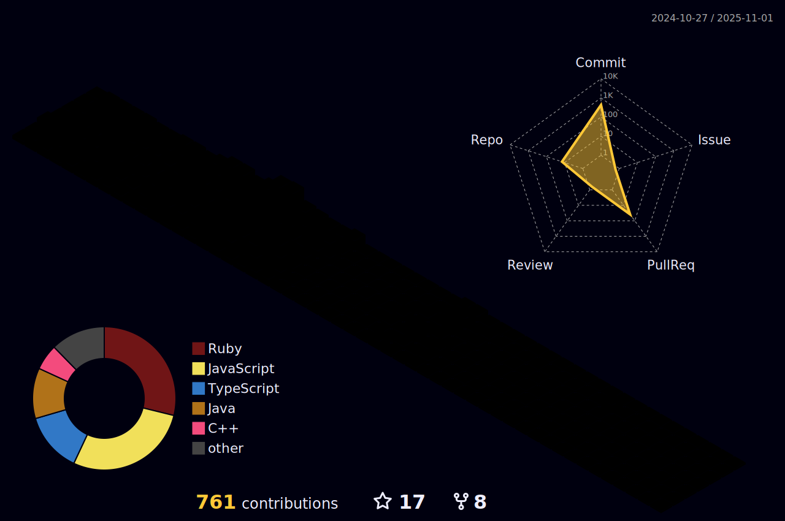

<h2 align="left">🌟Welcome to my profile, learn a little about me!</h2>

###

☕ Backend Developer | Java & Spring Boot Enthusiast | 🚀 Node.js, JavaScript & TypeScript Advocate   Hi there! I'm a passionate backend developer with experience in creating robust APIs and microservices using Java and Spring Boot. I also bring expertise in PHP and Laravel, crafting scalable solutions that combine performance with quality. Additionally, I have a keen interest in Node.js, JavaScript, and TypeScript, leveraging their ecosystems to develop modern, efficient applications. Let's connect and build something amazing together!

###

<h2 align="left">📲Social Media</h2>

###

  
  
  
  

###

###

<h2 align="left">💻Technologies</h2>

###

  
  
  
  
  
  
  
  
  
  
  
  
  
  
  
  
  
  
  
  
  

###

  
  

### 
