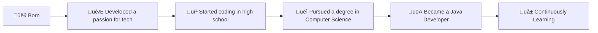

# 🚀 Welcome to My GitHub Profile!☕

 

## 🌟 About Me

- 🌱 Currently exploring advanced **Spring Boot** features to deepen my expertise and deliver cutting-edge solutions.
- 💼 Demonstrated experience in designing and implementing APIs for certificate management and verification, ensuring robust security and reliability.
- 🔍 Eager to collaborate on groundbreaking open-source projects and make meaningful contributions to the tech community.

## 🛤️ My Development Journey

## 📫 How to reach me

## 🛠️ Technologies & Tools

## ⚙️ Frameworks

## 📈 GitHub Stats

