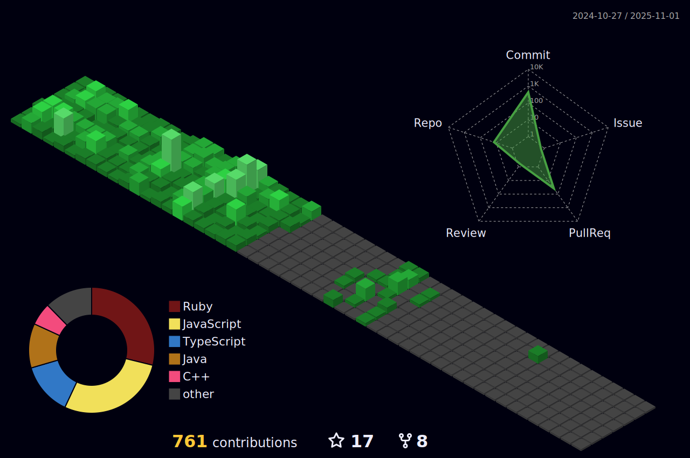

<h2 align="center">🌟Welcome to my profile, learn a little about me!</h2>

###

Backend Developer | Java & Spring Boot Enthusiast | Node.js, JavaScript & TypeScript Advocate | Venturing into ruby ​​on rails

###

<h2 align="center">📲Social Media</h2>

###

  
  
  
  

###

###

<h2 align="center">💻Technologies</h2>

###

  
  
  
  
  
  
  
  
  
  
  
  
  
  
  
  
  
  
  
  
  

###

  

### 
