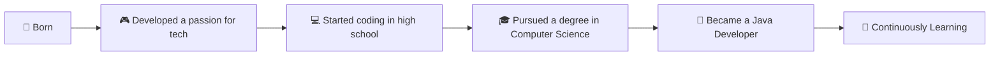

# 🚀 Welcome to the GitHub Profile of ☕

 

- 🌱 I’m currently learning advanced **Spring Boot** features.
- 💼 I have experience in developing APIs for managing and verifying certificates.
- 🔍 I’m looking for opportunities to collaborate on open-source projects.

## 🛤️ My Development Journey

```mermaid
graph LR
A[👶 Born] --> B[🎮 Developed a passion for tech]
B --> C[💻 Started coding in high school]
C --> D[🎓 Pursued a degree in Computer Science]
D --> E[🚀 Became a Java Developer]
E --> F[🌱 Continuously Learning]
```

## 📫 How to reach me

## 🛠️ Technologies & Tools

## 📈 GitHub Stats

